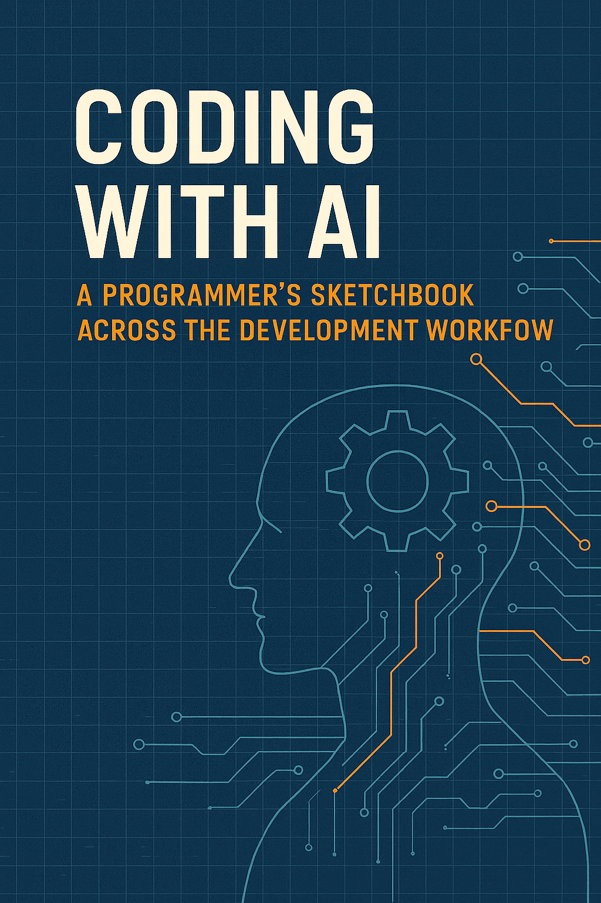

# Coding with AI
## A Developer’s Sketchbook Across the Development Workflow

Artificial Intelligence is no longer a distant promise of the future—it’s here, embedded in the tools we use every day, including the ones we use to write code. This scratchbook is a practical guide to exploring the evolving intersection of coding and AI. 

Whether you’re a student, a self-taught programmer, or a professional looking to sharpen your skills, this book offers a structured journey through exercises that reflect real-world scenarios. From fixing syntax errors to building software projects with graphical interfaces, the chapters are designed to help you develop a deeper understanding of both programming and how to collaborate with AI-based tools.

The scratchbook is divided into three parts:

* Part I: Basic Coding with AI introduces foundational practices such as writing algorithms, commenting code, and understanding language translation—all with AI-assisted workflows.

* Part II: Software Construction with AI shifts focus to more complex software engineering tasks like refactoring, working with data structures, and automated testing.

* Part III: Software Projects with AI challenges you to put your skills into practice through hands-on development of APIs and graphical interfaces, leveraging AI throughout.

You’ll be encouraged to interact with AI tools—not just as passive assistants but as collaborators that can enhance creativity, efficiency, and critical thinking.

## How to Use This Material

This scratchbook is designed as a collection of standalone exercises—each chapter focuses on a specific topic and can be read independently of the others. You can dip in wherever your interests or needs take you.

The only prerequisite is a basic understanding of programming concepts. You don’t need to be an expert; the exercises are meant to be approachable and practical, even if you’re still early in your coding journey.

The content is intentionally agnostic to specific AI tools. Whether you’re using ChatGPT, GitHub Copilot, or another assistant, the key idea is to explore how AI can support you in writing, understanding, and improving code. That said, using an AI tool that integrates well with your coding environment—especially one that works inside Jupyter notebooks—can make the experience smoother and more interactive.

Feel free to experiment, adapt, and build on what’s here. This is a hands-on guide, and the best way to learn is by doing.

## Acknowledgments

Thanks to Alberto Bacchelli for the fruitful discussions during the development of the material for the Python coding bootcamp at the University of St. Gallen.
To Paul-Philipp Luley, for helping structure the material and make it more systematic.
And to Jahrim Cesario, for contributing some of the content included in this book.
