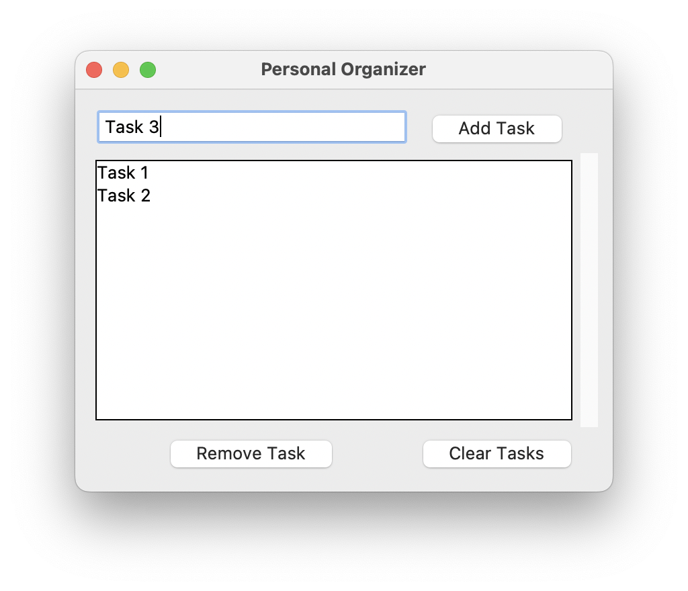

# 17 Graphical Interfaces

A common element of a software application is a Graphical User Interface (GUI). There are several GUI libraries that one can use in Python, for example Tkinter, PyQt, PySide, Kivy, wxPython, PyGTK, PySimpleGUI.

Creating a GUI may require a lot of [boilerplate code](https://en.wikipedia.org/wiki/Boilerplate_code) and it is convenient to generate them with an AI.


## 17.1 Task: Minimal GUI Implementation

This is a minimal interface based on the Tkinter GUI library. It has been generated with the prompt "I would like to write a minimal Python program with the Tkinter graphics library".

- Check that this code is working and displays a GUI
- Install the Tkinter graphics library if needed (e.g., "pip install tk")
- Try to generate a similar program with AI


```python
import tkinter as tk

# Create the main window
root = tk.Tk()
root.title("Minimal Tkinter Example")

# Set the size of the window
root.geometry("300x200")

# Create a label widget
label = tk.Label(root, text="Hello, Tkinter!")
label.pack(pady=20)

# Create a button widget
def on_button_click():
    label.config(text="Button Clicked!")

button = tk.Button(root, text="Click Me", command=on_button_click)
button.pack(pady=20)

# Run the application
root.mainloop()
```


```python

```

## 17.2 Task: Basic Tkinter GUI with Standard Widgets

A GUI is usually created by combining predefined [graphical widgets](https://en.wikipedia.org/wiki/Graphical_widget) to compose the interface. Graphics libraries often provide standard widgets one can interact to, such as Label, Button, Checkbutton, Radiobutton, Scrollbar, Progressbar, Separator, etc. You can check the list of the [Tkinter Widgets](https://tkdocs.com/tutorial/widgets.html) supported by the Tkinter library.

- Create a GUI with some of the basic widgets above, such as Label, Button, Checkbutton, Radiobutton.
- Combine some widgets together in the same GUI.


```python

```

## 17.3 Task: Task Manager with Tkinter

Generate a (rather complex) GUI that for a task manager application.
The GUI gives users the ability to create new tasks, keep a list of tasks and remove tasks.
The GUI looks like this:



A possible solution is below.
Note how the UI is connected to the logic of the application.
For example, these lines of code create the Task button widget and link the `add_task` function to it:

```python
# Add Task button
add_task_button = ttk.Button(main_frame, text="Add Task", command=add_task)
add_task_button.grid(row=0, column=1, padx=5, pady=5)
```

As a resut, when the button is pressed, the function `add_task` is executed
and the task is added to the list:

```python
def add_task():
    task = task_entry.get()
    if task:
        tasks_listbox.insert(tk.END, task)
        task_entry.delete(0, tk.END)
    else:
        messagebox.showwarning("Input Error", "Please enter a task.")
```


```python
import tkinter as tk
from tkinter import ttk, messagebox

## APPLICATION LOGIC

def add_task():
    task = task_entry.get()
    if task:
        tasks_listbox.insert(tk.END, task)
        task_entry.delete(0, tk.END)
    else:
        messagebox.showwarning("Input Error", "Please enter a task.")

def remove_task():
    selected_task_index = tasks_listbox.curselection()
    if selected_task_index:
        tasks_listbox.delete(selected_task_index)
    else:
        messagebox.showwarning("Selection Error", "Please select a task to remove.")

def clear_tasks():
    if messagebox.askyesno("Clear Tasks", "Are you sure you want to clear all tasks?"):
        tasks_listbox.delete(0, tk.END)

def about():
    messagebox.showinfo("About", "This is a simple personal organizer application built with Tkinter.")

def exit_app():
    root.quit()

## BUILDING THE GUI

# Initialize the main window
root = tk.Tk()
root.title("Personal Organizer")
root.geometry("400x300")

# Create the menu bar
menu_bar = tk.Menu(root)
root.config(menu=menu_bar)

# Add File menu
file_menu = tk.Menu(menu_bar, tearoff=0)
menu_bar.add_cascade(label="File", menu=file_menu)
file_menu.add_command(label="Exit", command=exit_app)

# Add Help menu
help_menu = tk.Menu(menu_bar, tearoff=0)
menu_bar.add_cascade(label="Help", menu=help_menu)
help_menu.add_command(label="About", command=about)

# Create the main frame
main_frame = ttk.Frame(root, padding="10")
main_frame.pack(fill=tk.BOTH, expand=True)

# Task entry
task_entry = ttk.Entry(main_frame, width=40)
task_entry.grid(row=0, column=0, padx=5, pady=5)

# Add Task button
add_task_button = ttk.Button(main_frame, text="Add Task", command=add_task)
add_task_button.grid(row=0, column=1, padx=5, pady=5)

# Task list
tasks_listbox = tk.Listbox(main_frame, height=10, selectmode=tk.SINGLE)
tasks_listbox.grid(row=1, column=0, columnspan=2, padx=5, pady=5, sticky="nsew")

# Add scroll bar for the listbox
scrollbar = ttk.Scrollbar(main_frame, orient=tk.VERTICAL, command=tasks_listbox.yview)
scrollbar.grid(row=1, column=2, sticky='ns')
tasks_listbox.configure(yscrollcommand=scrollbar.set)

# Remove Task button
remove_task_button = ttk.Button(main_frame, text="Remove Task", command=remove_task)
remove_task_button.grid(row=2, column=0, padx=5, pady=5)

# Clear Tasks button
clear_tasks_button = ttk.Button(main_frame, text="Clear Tasks", command=clear_tasks)
clear_tasks_button.grid(row=2, column=1, padx=5, pady=5)

# Configure the grid
main_frame.rowconfigure(1, weight=1)
main_frame.columnconfigure(0, weight=1)

# Start the main event loop
root.mainloop()
```


```python

```

## 17.4 Task: Geometry Program GUI

In the previous task, the first part of the program consists of the program logic (i.e. the functionalities of the program) and the second part creates the GUI. These two parts are conceptually different and you can ask the AI to generate them independently.

Below is a Python program that performs some simple computations on geometric figures (adapted from here https://www.javatpoint.com/menu-driven-programs-in-python). The program is also broken down into application logic and user interface. In this case, however, th user interface is text-based, with a simple multiple-choice menu.

- Run the program to better understand the logic.
- Add a GUI using the AI, replacing the text-based UI. Note that the GUI can be very basic up to elaborate (e.g., to display the geometric figures, etc). See the list of the [Tkinter Widgets](https://tkdocs.com/tutorial/widgets.html) for some inspiration.
- Try different approaches to building the GUI. You can ask the AI to generate it in one shot or you can ask the AI to generate it incrementally, specifying, stp-by-step which widget you would like to add.


```python
## APPLICATION LOGIC

# defining functions  
def p_circle(radius):  
    para = 2 * 3.14 * radius  
    print("Parameter of Circle:", para)  
  
def p_rectangle(height, width):  
    para = 2 * (height + width)  
    print("Parameter of Rectangle:", para)  
  
def p_square(side):  
    para = 4 * side  
    print("Parameter of Square:", para)  
  
def a_circle(radius):  
    area = 3.14 * radius * radius  
    print("Area of Circle:", area)  
  
def a_rectangle(height, width):  
    area = height * width  
    print("Area of Rectangle:", area)  
  
def a_square(side):  
    area = side * side  
    print("Area of Square:", area)  
  
# printing the starting line  
print("WELCOME TO A SIMPLE MENSURATION PROGRAM")  
  
## BUILDING THE GUI

# creating options  
while True:  
    print("\nMAIN MENU")  
    print("1. Calculate Parameter")  
    print("2. Calculate Area")  
    print("3. Exit")  
    choice1 = int(input("Enter the Choice:"))  
  
    if choice1 == 1:  
        print("\nCALCULATE PARAMETER")  
        print("1. Circle")  
        print("2. Rectangle")  
        print("3. Square")  
        print("4. Exit")  
        choice2 = int(input("Enter the Choice:"))  
  
        if choice2 == 1:  
            radius = int(input("Enter Radius of Circle:"))  
            p_circle(radius)  
              
        elif choice2 == 2:  
            height = int(input("Enter Height of Rectangle:"))  
            width = int(input("Enter Width of Rectangle:"))  
            p_rectangle(height, width)  
              
        elif choice2 == 3:  
            side = int(input("Enter Side of Square:"))  
            p_square(side)  
  
        elif choice2 == 4:  
            break  
              
        else:  
            print("Oops! Incorrect Choice.")  
      
    elif choice1 == 2:  
        print("\nCALCULATE AREA")  
        print("1. Circle")  
        print("2. Rectangle")  
        print("3. Square")  
        print("4. Exit")  
        choice3 = int(input("Enter the Choice:"))  
  
        if choice3 == 1:  
            radius = int(input("Enter Radius of Circle:"))  
            a_circle(radius)  
              
        elif choice3 == 2:  
            height = int(input("Enter Height of Rectangle:"))  
            width = int(input("Enter Width of Rectangle:"))  
            a_rectangle(height, width)  
              
        elif choice3 == 3:  
            side = int(input("Enter Side of Square:"))  
            a_square(side)  
  
        elif choice3 == 4:  
            break  
              
        else:  
            print("Oops! Incorrect Choice.")  
      
    elif choice1 == 3:  
        break  
      
    else:  
        print("Oops! Incorrect Choice.")  
```


```python
import tkinter as tk
from tkinter import ttk, messagebox

## APPLICATION LOGIC

def add_task():
    task = task_entry.get()
    if task:
        tasks_listbox.insert(tk.END, task)
        task_entry.delete(0, tk.END)
    else:
        messagebox.showwarning("Input Error", "Please enter a task.")

def remove_task():
    selected_task_index = tasks_listbox.curselection()
    if selected_task_index:
        tasks_listbox.delete(selected_task_index)
    else:
        messagebox.showwarning("Selection Error", "Please select a task to remove.")

def clear_tasks():
    if messagebox.askyesno("Clear Tasks", "Are you sure you want to clear all tasks?"):
        tasks_listbox.delete(0, tk.END)

def about():
    messagebox.showinfo("About", "This is a simple personal organizer application built with Tkinter.")

def exit_app():
    root.quit()

## BUILDING THE GUI

# Initialize the main window
root = tk.Tk()
root.title("Personal Organizer")
root.geometry("400x300")

# Create the menu bar
menu_bar = tk.Menu(root)
root.config(menu=menu_bar)

# Add File menu
file_menu = tk.Menu(menu_bar, tearoff=0)
menu_bar.add_cascade(label="File", menu=file_menu)
file_menu.add_command(label="Exit", command=exit_app)

# Add Help menu
help_menu = tk.Menu(menu_bar, tearoff=0)
menu_bar.add_cascade(label="Help", menu=help_menu)
help_menu.add_command(label="About", command=about)

# Create the main frame
main_frame = ttk.Frame(root, padding="10")
main_frame.pack(fill=tk.BOTH, expand=True)

# Task entry
task_entry = ttk.Entry(main_frame, width=40)
task_entry.grid(row=0, column=0, padx=5, pady=5)

# Add Task button
add_task_button = ttk.Button(main_frame, text="Add Task", command=add_task)
add_task_button.grid(row=0, column=1, padx=5, pady=5)

# Task list
tasks_listbox = tk.Listbox(main_frame, height=10, selectmode=tk.SINGLE)
tasks_listbox.grid(row=1, column=0, columnspan=2, padx=5, pady=5, sticky="nsew")

# Add scroll bar for the listbox
scrollbar = ttk.Scrollbar(main_frame, orient=tk.VERTICAL, command=tasks_listbox.yview)
scrollbar.grid(row=1, column=2, sticky='ns')
tasks_listbox.configure(yscrollcommand=scrollbar.set)

# Remove Task button
remove_task_button = ttk.Button(main_frame, text="Remove Task", command=remove_task)
remove_task_button.grid(row=2, column=0, padx=5, pady=5)

# Clear Tasks button
clear_tasks_button = ttk.Button(main_frame, text="Clear Tasks", command=clear_tasks)
clear_tasks_button.grid(row=2, column=1, padx=5, pady=5)

# Configure the grid
main_frame.rowconfigure(1, weight=1)
main_frame.columnconfigure(0, weight=1)

# Start the main event loop
root.mainloop()
```
